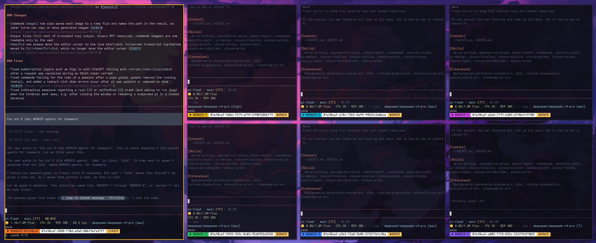

# 🪟 Pi Fleet WM

[](./LICENSE) [](https://pi.dev)

<p align="center">
  <a href="README.md"><strong>English</strong></a> |
  <a href="README.zh-CN.md">简体中文</a> |
  <a href="README.es.md">Español</a> |
  <a href="README.fr.md">Français</a> |
  <a href="README.de.md">Deutsch</a> |
  <a href="README.ja.md">日本語</a> |
  <a href="README.ko.md">한국어</a> |
  <a href="README.pt.md">Português</a> |
  <a href="README.ru.md">Русский</a>
</p>

A window-manager-native fork of [`pi-fleet`](./packages/pi-fleet) for the [Pi Coding Agent](https://pi.dev).
Instead of tmux or headless subprocesses, every agent is a **real terminal window** running a full Pi TUI, tiled by the **i3 window manager**.



## Introduction

pi-fleet-wm reworks pi-fleet around the i3 tiling window manager.
Each agent runs as a real terminal window (`alacritty -e`) with a complete Pi TUI — never a headless child process.
Newly spawned windows are pinned to the lead session's i3 workspace, and every window shows a footer badge
(● name · sessionId · LEADER / WORKER) so you can tell the leader from the workers at a glance.

## What's different from upstream pi-fleet

- **Real windows, no multiplexer** — an `external` backend spawns a plain terminal window (`alacritty -e`) that i3 tiles; no tmux, Zellij, or Ghostty needed.
- **`pinToLeadWorkspace`** — new external windows land on the lead session's i3 workspace instead of the focused one. The lead workspace is located by walking the process tree to the terminal's `_NET_WM_PID`, then moved with `i3-msg`; placement is best-effort and never blocks launch.
- **Lead / worker roles** — footer badges show `LEADER` / `WORKER` with per-session colors; `/lead`, `/color`.
- **Steer relay** — text you type into a worker window is relayed into the leader's model context.
- **`session_bus shutdown`** — the leader can gracefully tear down a worker window.
- Human-started sessions default to `MANAGER-<id>` and self-lead automatically.

See [`docs/pi-fleet-project-history.md`](docs/pi-fleet-project-history.md) for the full change history and [`packages/pi-fleet/README.md`](packages/pi-fleet/README.md) for the complete extension reference.

## 🚀 Quick start

Build and load the extension from this checkout:

```bash
npm install
npm --workspace @narumitw/pi-fleet run build
pi --no-extensions -e ./packages/pi-fleet
```

Or install it as a local package:

```bash
pi install ./packages/pi-fleet
```

Run under i3 with the external backend:

```json
{
  "defaultTerminal": "external",
  "externalCommand": "alacritty -e",
  "confirmSessionLaunch": false,
  "pinToLeadWorkspace": true
}
```

Use `/fleet`, `session_spawn`, and `session_bus` to launch, steer, and shut down the fleet.

## 🗂️ Repository layout

```text
packages/pi-fleet/        The pi-fleet-wm extension (authoritative implementation under src/)
docs/                     Project history, images, and repository conventions
deprecated/               Upstream packages excluded from active workspace scripts
packages/                 The full upstream pi-extensions monorepo, preserved from the fork
```

This repository is a fork of [`narumiruna/pi-extensions`](https://github.com/narumiruna/pi-extensions).
All upstream extension packages remain under `packages/` and keep their own READMEs and licenses.

## 📄 License

MIT. See [`LICENSE`](./LICENSE).
